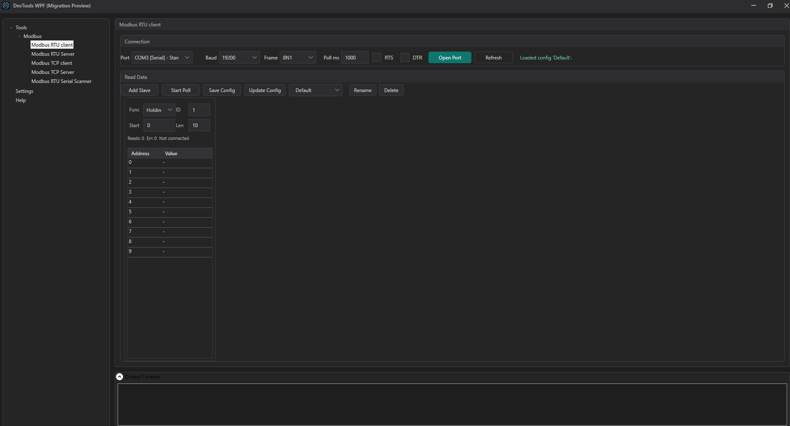
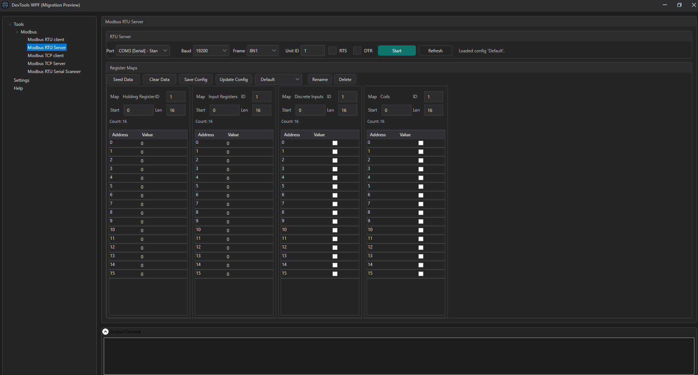

# DevTools WPF

DevTools WPF is a professional Windows toolbox for the kinds of field jobs I work on.
It brings the tools I use most often into one place and is designed to grow as the work evolves.

DevTools WPF includes:
- Modbus TCP Client
- Modbus TCP Server
- Modbus RTU Client
- Modbus RTU Server
- RTU Serial Scanner (multi-baud/frame discovery)
- Console command system for diagnostics and register dumps

## Highlights

- Live polling and editable register maps
- Shared server runtime state across view switches
- Packet-level diagnostics controls
- Preset-based workflow for quick reconnects
- Built-in help and troubleshooting guide

## Screenshots

### RTU Client



### RTU Server



## Requests and Ideas

More tools will be added over time.
If you use this app and have a useful addition in mind, you are welcome to request it.

## Tech Stack

- .NET 8
- WPF (Windows)

## Quick Start

### Prerequisites
- Windows 10/11
- .NET SDK 8.0+

### Build

```powershell
dotnet build DevTools.sln
```

### Run

```powershell
dotnet run --project src/DevTools.Wpf/DevTools.Wpf.csproj
```

### Publish (Release)

```powershell
dotnet publish src/DevTools.Wpf/DevTools.Wpf.csproj -c Release -r win-x64 --self-contained false
```

## Console Commands

- /help
- /clear
- /status
- /loglevel info|debug
- /packets on|off
- /regs [tcp|rtu] all [start count]
- /sync [tcp|rtu|all]

## Release Notes

See [CHANGELOG.md](CHANGELOG.md) for version history.

## License

This project is licensed under the DevTools Non-Resale License v1.0. See [LICENSE](LICENSE).
